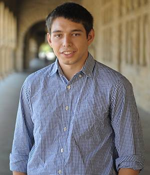
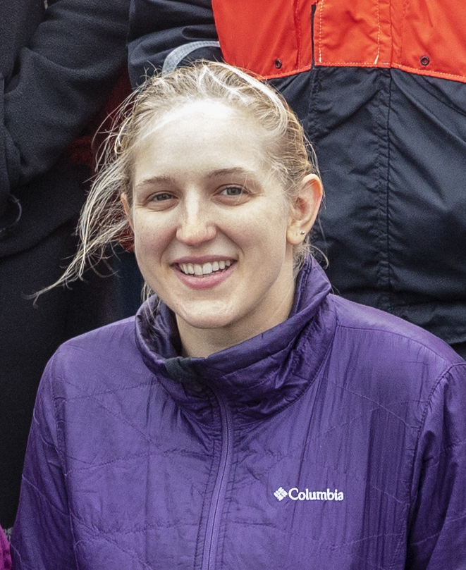
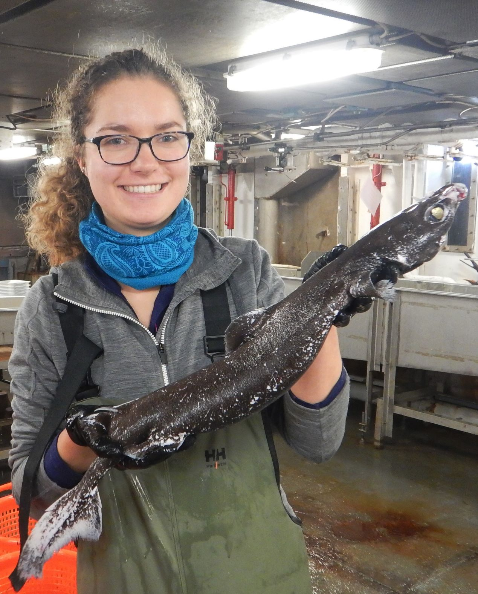
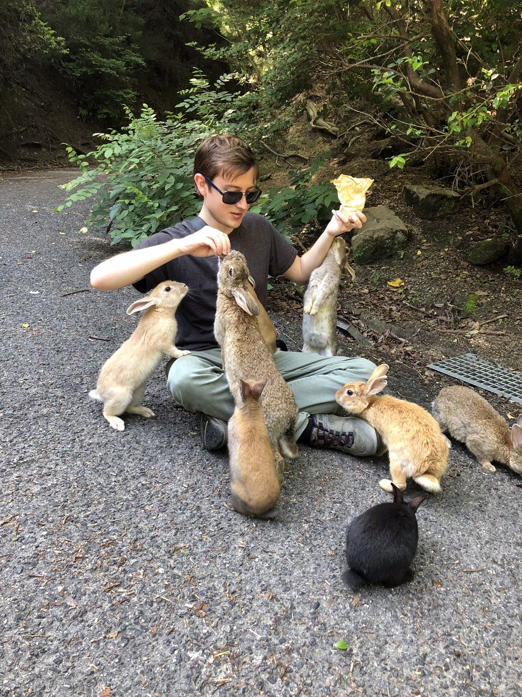

# .right[Brett Longworth]

.pull-left[]

.pull-right[

Research Associate, Geology and Geophysics

Research Interests: Accelerator Mass Spectrometry, radiocarbon, data mining for method development, links between the marine and terrestrial carbon cycle.

Fun fact: Number of living things I take care of has gone up by billions since the pandemic. Mostly sourdough. Some chickens.

]

---

# .right[Craig McLean]

.pull-left[]

.pull-right[

4th Year Joint Program Student

Research Interests: Metabolism, computational biology, ecology, nutrient stress, and phytoplankton.

Fun Fact: I’m a nerd about contemporary Russian culture.

]

---

# .right[Stace Beaulieu]

.pull-left[]

.pull-right[

Senior Research Specialist in Biology

Research Interests: Biological Oceanography, Marine Biodiversity, Ocean Informatics, Deep-Sea Animals!

Fun fact: I love mountain biking, yes even on Cape Cod
]

.footnote[
That’s me on the left, setting up
acoustic releases for a mooring
]

---

# .right[Chrissy Hernandez]

.pull-left[]

.pull-right[

PhD student in Biology

Research Interests: larval fish ecology, population dynamics, mathematical ecology, life history evolution, resource management

Fun Fact: I like to knit, and I finished my first-ever sweater in April.

]

---

# .right[Arianna Krinos]

.pull-left[]

.pull-right[

PhD Student in Biological Oceanography

Research Interests: Biological Oceanography, Phytoplankton, Microbial Ecology, Computational Biology, Modeling, Algorithms, Teaching & Outreach

Fun fact: I have 4 younger siblings & I’ve  been called for homework help by 3/4 in the past month

]

---

# .right[Ciara Willis]

.pull-left[]

.pull-right[

Ciara Willis, PhD Student in Biological Oceanography

Research Interests: Marine connectivity (movement ecology, larval dispersal, trophic interactions), fisheries governance, statistics

Fun fact: I collect plush sea creatures

]

---

# .right[Ryan Govostes]

.pull-left[]

.pull-right[

Software Engineer, WHOI

Research Interests: Cybersecurity, static analysis, software reliability

Fun fact: Met Viggo Mortensen (Lord of the Rings) at a car rental counter at 11 pm on the day I traveled to my WHOI interview

]

---

# Introductions

Name, Program and Lab, what you'd like to learn or do with this course

.center[Collaborative course notes: https://pad.carpentries.org/2020-06-22-WHOI-R]

---

# Pre-course survey
## R is everywhere!

R has great tools for reports, papers, even books and websites. (and presentations!)

No more cutting and pasting figures or forgetting to update data!

---

# Why R, What makes data science reproducible?

* Can you reproduce your analysis?
* How about 5 years later?
* Can a colleague if you send them the data and method/code?
* Can you easily add data and regenerate the analysis? Figures? Report or paper?

.footnote[Grolemund and Wickham, [R for Data Science](https://r4ds.had.co.nz/index.html)]

---

<iframe width="560" height="315" src="https://www.youtube.com/embed/s3JldKoA0zw" frameborder="0" allow="accelerometer; autoplay; encrypted-media; gyroscope; picture-in-picture" allowfullscreen></iframe>

---

# Course website

https://blongworth.github.io/2020-06-22-WHOI-R/

---

# Getting help and giving feedback

We are here to help! Raise your hand an a helper or instructor will message you in the chat. If it can be solved via chat you and the helper will move to a breakout room to talk through the problem.

We'll also ask for input and feedback often. Use "yes" and "no" in the participants window. Coffee break indicator also welcome, but we've got a lot to cover!

---

# Code of Conduct

We are dedicated to providing a welcoming and supportive environment for all people, regardless of background or identity. Any form or behavior to exclude, intimidate, or cause discomfort is a violation of the Code of Conduct. In order to foster a positive and professional learning environment we encourage the following kinds of behavior in all platforms and events:

* Use welcoming and inclusive language
* Be respectful of different viewpoints and experiences
* Gracefully accept constructive criticism
* Focus on what is best for the community
* Show courtesy and respect towards other community members

---

class: center, middle

.footnote[The Carpentries: https://carpentries.org/]

---

class: center, middle

# Thanks!

Slides created via the R package [**xaringan**](https://github.com/yihui/xaringan).

The chakra comes from [remark.js](https://remarkjs.com), [**knitr**](http://yihui.org/knitr), and [R Markdown](https://rmarkdown.rstudio.com).
