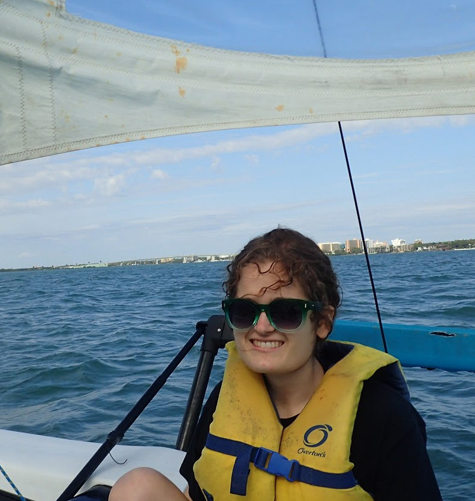
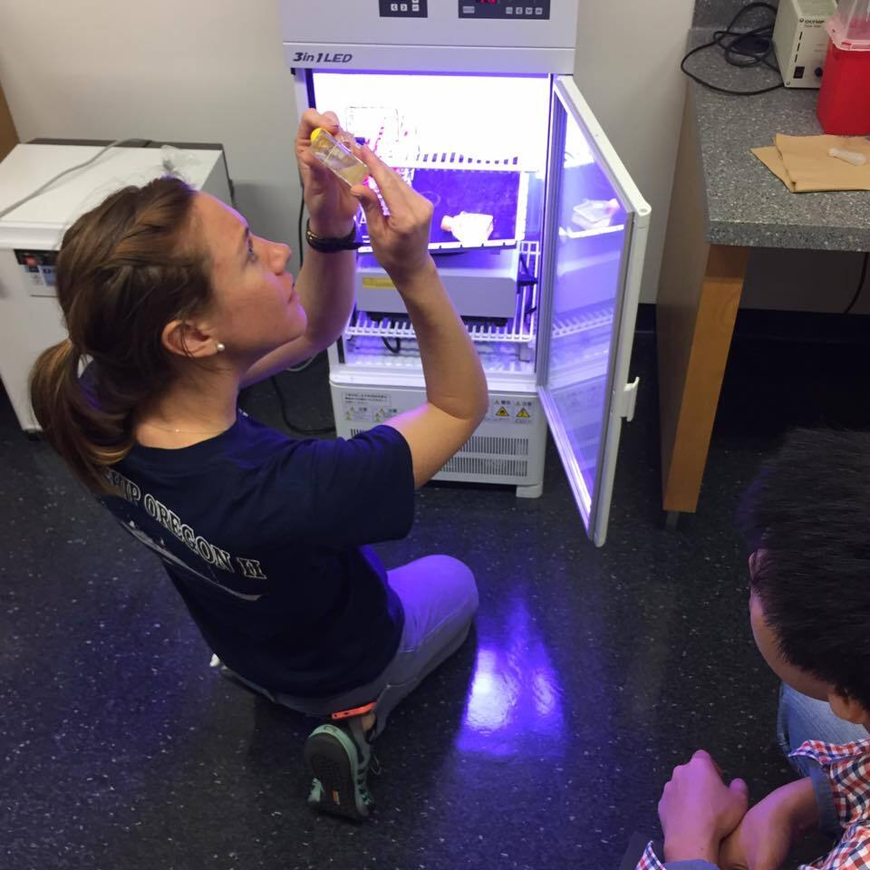
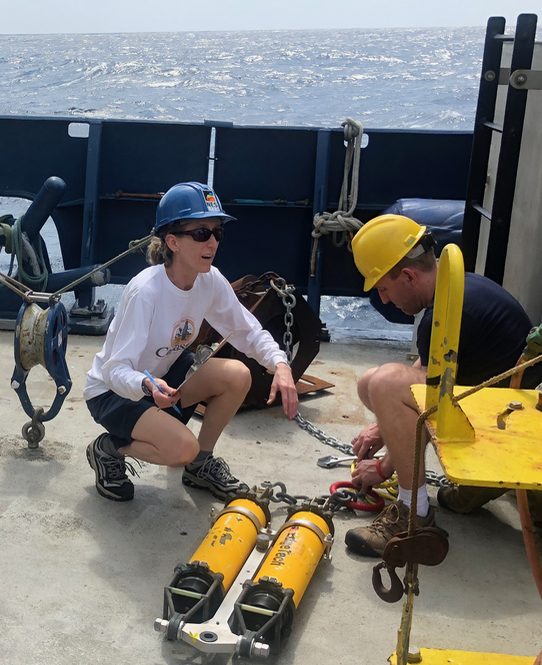
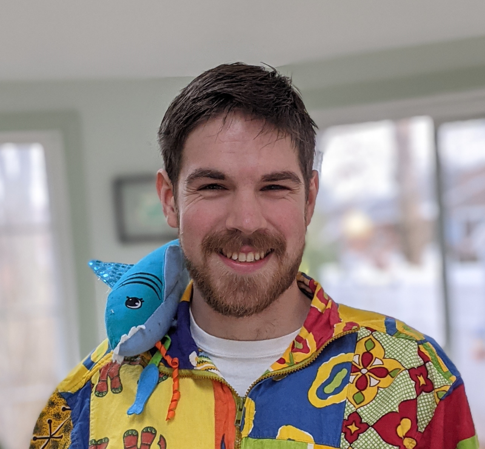
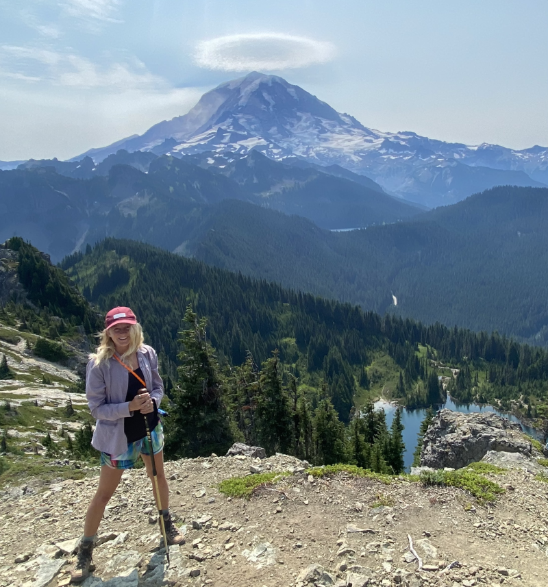
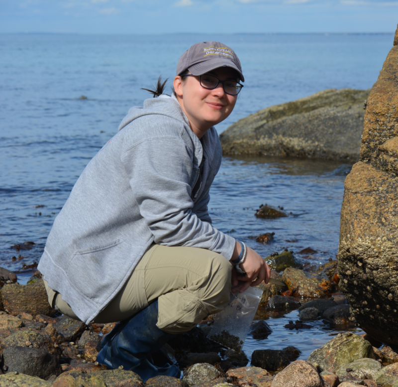
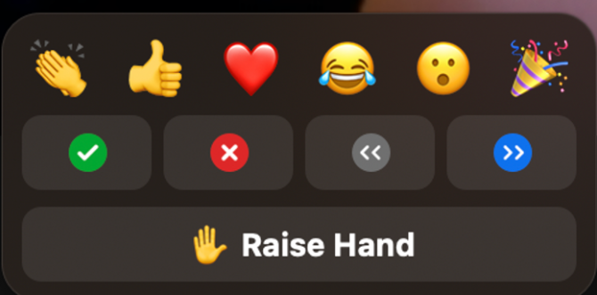

# .right[Brett Longworth]

.pull-left[]

.pull-right[

Research Associate, Geology and Geophysics

**Research Interests:** Accelerator Mass Spectrometry, radiocarbon, data mining for method development, links between the marine and terrestrial carbon cycle.

**Fun fact:** Number of living things I take care of has gone up by billions since the pandemic. Mostly sourdough. Some chickens.

]

---

# .right[Arianna Krinos]

.pull-left[]

.pull-right[

PhD Student in Biological Oceanography

**Research Interests:** Biological Oceanography, Phytoplankton, Microbial Ecology, Computational Biology, Modeling, Algorithms, Teaching & Outreach

**Fun fact:** I have 4 younger siblings & I’ve been called for homework help by 3/4 in the past month

]

---

# .right[Maggi Mars Brisbin]

.pull-left[]

.pull-right[

Postdoctoral Scholar, Biology and Marine Chemistry & Geochemistry

**Research Interests:** Biological oceanography, microbiology, phytoplankton physiology, plankton ecology, data science with R and Python

**Fun fact:** I’ve lived in Okinawa, Japan for the last 6.5 years.

]

---

# .right[Joe Futrelle]

.pull-left[]

.pull-right[

Software Engineer at WHOI

**Research Interests:** Open science, open data, databases, data-intensive computing, machine learning, software engineering best practices

**Fun fact:** I was a bassist for the 90s space-rock band Hum

]

---
# .right[Stace Beaulieu]

.pull-left[]

.pull-right[

Senior Research Specialist in Biology

**Research Interests:** Biological Oceanography, Marine Biodiversity, Ocean Informatics, Deep-Sea Animals!

**Fun fact:** I love mountain biking, yes even on Cape Cod
]

.footnote[
That’s me on the left, setting up
acoustic releases for a mooring
]

---
# .right[Cory Berger]

.pull-left[]

.pull-right[

PhD Candidate in Biological Oceanography

**Research Interests:** Evolution, phylogenetics, invertebrate physiology, -omics, circadian rhythms. 

**Fun fact:** I performed in Superbowl 50
]

---
# .right[Sarah Glancy]

.pull-left[]

.pull-right[

**Research Interests:**

**Fun fact:**
]

---
# .right[Kali Horn]

.pull-left[]

.pull-right[

Research Assistant Biology 

**Research Interests:** HABS (harmful algal blooms), population dynamics, phytoplankton ecology and physiology, Marine outreach and education!

**Fun fact:** I hiked the wonderland trail this summer!
]

---
# .right[Kate Morkeski]

.pull-left[]

.pull-right[

**Research Interests:**

**Fun fact:**
]

---
# .right[Jane Weinstock]

.pull-left[]

.pull-right[

PhD candidate in Biological Oceanography

**Research Interests:** Marine ecology, larval dispersal, invertebrate phenology, population connectivity

**Fun fact:** I just recently accomplished a 2-year mission to get my first orchid to flower again
]
---
# Introductions – Your turn!

Name, 1-5 words about research, what you'd like to learn in this course, and what project(s) you'd like to do with R.

.center[Collaborative course notes: https://pad.carpentries.org/2020-11-09-WHOI-R]

---

# Pre-course survey
## R is everywhere!

R has great tools for reports, papers, even books and websites. (and presentations!)

No more cutting and pasting figures or forgetting to update data!

---

# Why R, What makes data science reproducible?

* Can you reproduce your analysis?
* How about 5 years later?
* Can a colleague if you send them the data and method/code?
* Can you easily add data and regenerate the analysis? Figures? Report or paper?

.footnote[Grolemund and Wickham, [R for Data Science](https://r4ds.had.co.nz/index.html)]

---
class: inverse, middle, center

<iframe width="95%" height="95%" src="https://www.youtube.com/embed/s3JldKoA0zw" frameborder="0" allow="accelerometer; autoplay; encrypted-media; gyroscope; picture-in-picture" allowfullscreen></iframe>

---

# Course website

https://blongworth.github.io/2020-11-09-WHOI-R/

---

# Getting help and giving feedback

We are here to help! Raise your hand and a helper or instructor will message you in the chat. If it can't be solved via chat you and the helper will move to a breakout room to talk through the problem.

We'll also ask for input and feedback often. Use "yes" and "no" in the participants window. Coffee break indicator also welcome, but we've got a lot to cover!

---

# Code of Conduct

We are dedicated to providing a welcoming and supportive environment for all people, regardless of background or identity. Any form or behavior to exclude, intimidate, or cause discomfort is a violation of the Code of Conduct. In order to foster a positive and professional learning environment we encourage the following kinds of behavior in all platforms and events:

* Use welcoming and inclusive language
* Be respectful of different viewpoints and experiences
* Gracefully accept constructive criticism
* Focus on what is best for the community
* Show courtesy and respect towards other community members

---

class: center, middle

.footnote[The Carpentries: https://carpentries.org/]

---

class: center, middle

# Thanks!

Slides created via the R package [**xaringan**](https://github.com/yihui/xaringan).

The chakra comes from [remark.js](https://remarkjs.com), [**knitr**](http://yihui.org/knitr), and [R Markdown](https://rmarkdown.rstudio.com).

---
